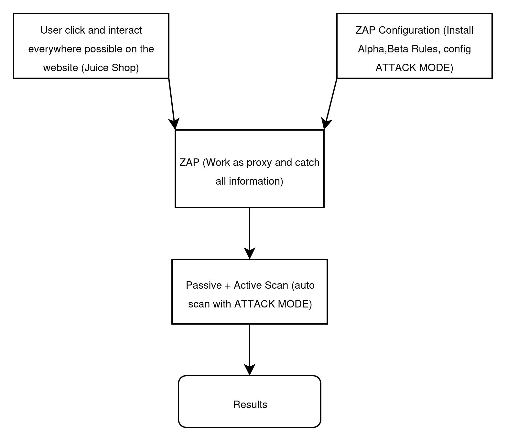
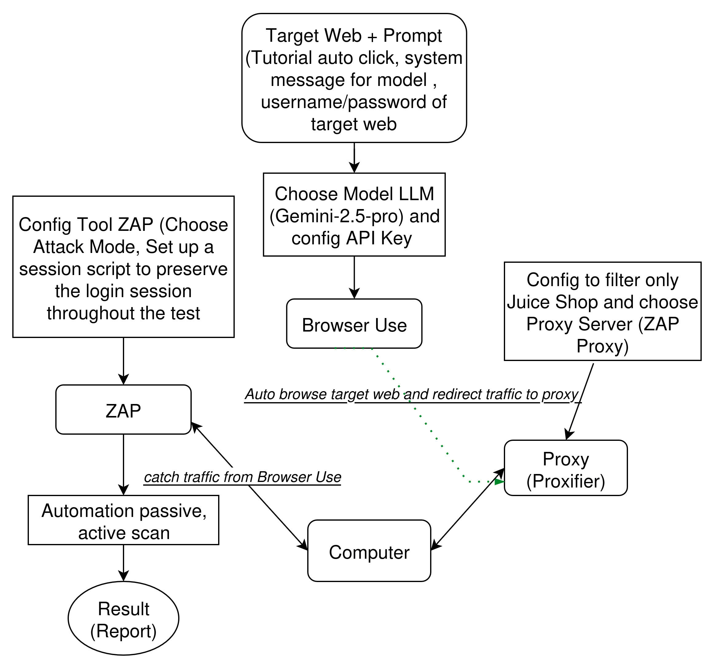

# Bổ sung thông tin ứng Web cho công cụ ZAP
## 1.Thủ công
Mục đích của cách này là thủ công tương tác với trang Web, sử dụng ZAP Proxy để ghi lại tất cả các thông tin tương tác. Sau đó tận dụng Engine của công cụ (Passive + Active scan) để kiểm thử trên các thông tin này. 

## 2. Pipeline tự động
Mục đích của cách này tương tự như cách thủ công, đều là để bổ sung thêm thông tin về ứng dụng Web cho công cụ ZAP. 

Cách này kết hợp một công cụ tự động UI là [Browser Use](https://github.com/browser-use/browser-use) để thực hiện tự động kiểm thử bảo mật dựa trên kịch bản cung cấp.  
Kịch bản được định nghĩa trong [gemini_auto.py](./gemini_auto.py)
### Hướng dẫn cài đặt và chạy scripts:

**Bước 1:**  
- Tạo môi trường ảo Python  
- Cài đặt Browser Use theo [Documentation](https://docs.browser-use.com/introduction)

**Bước 2:**  
- Khởi động ZAP  
- Đảm bảo cổng proxy của ZAP là **8080**

**Bước 3:**  
- Thiết lập Proxy cho hệ điều hành

  **Windows:**  
  - Cài đặt [Proxifier](https://www.proxifier.com/)
  - Thiết lập Proxy chỉ cho phép trang Web cần kiểm thử (Juice Shop) đi vào proxy  , các request khác đi trực tiếp ra internet. 
  - Khởi động và chạy script [auto](./gemini_auto.py)

---

## Tài liệu về công cụ Browser Use
[Documentation](https://docs.browser-use.com/introduction) 
[Installation](https://docs.browser-use.com/quickstart)
